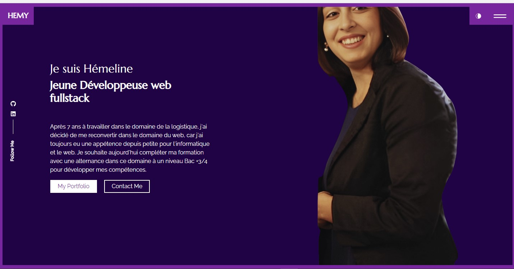

### Description

Portofolio crée à partir d'un modèle de portfolio public crée avec React/Bootstrap

Modèle accessible via le lien suivant : https://ubaimutl.github.io/react-portfolio/

[](https://emelinef26.github.io/Portfolio/)


### Setup

Get the code

```bash
git clone https://github.com/ubaimutl/react-portfolio.git
```

 
Install required dependencies

```bash
yarn install
```

Copy `.env.example` and name copy `.env`

Start the server

```bash
yarn start
```
